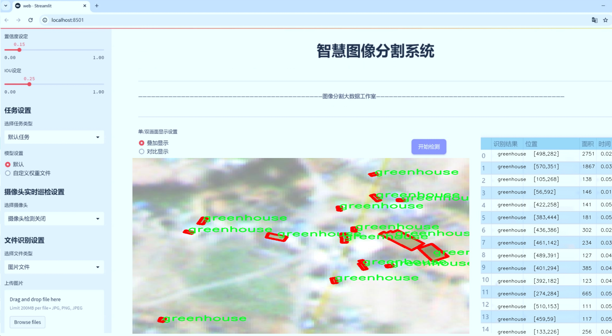
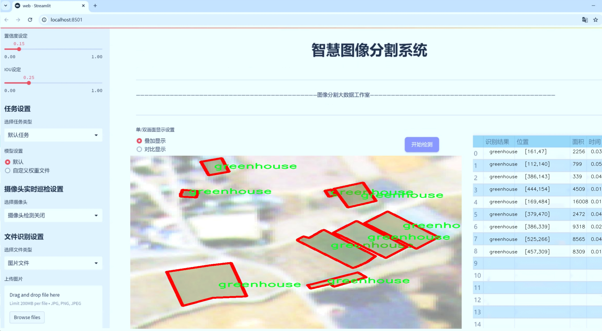
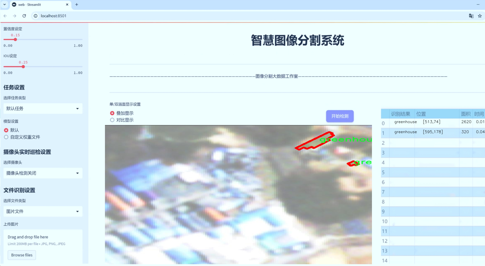
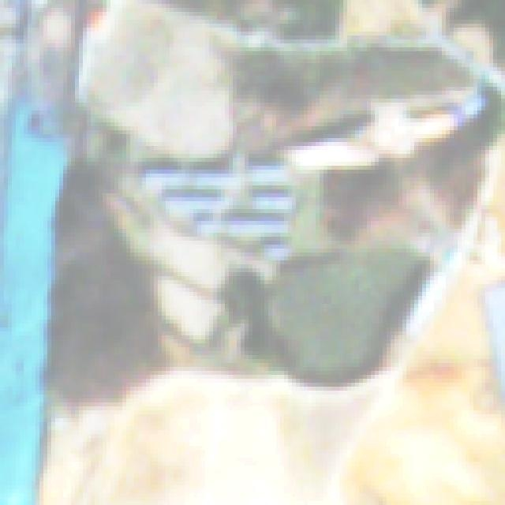
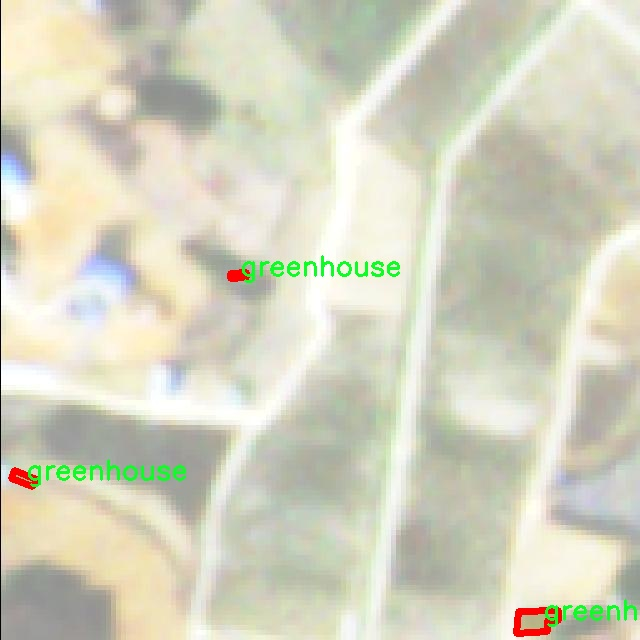
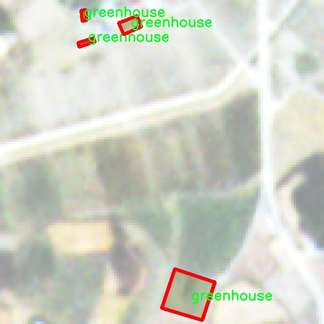
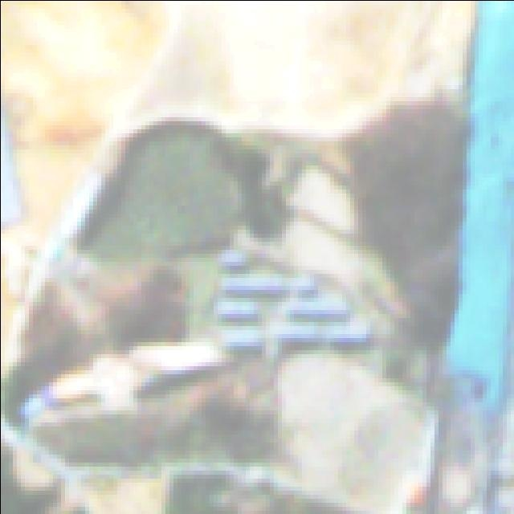
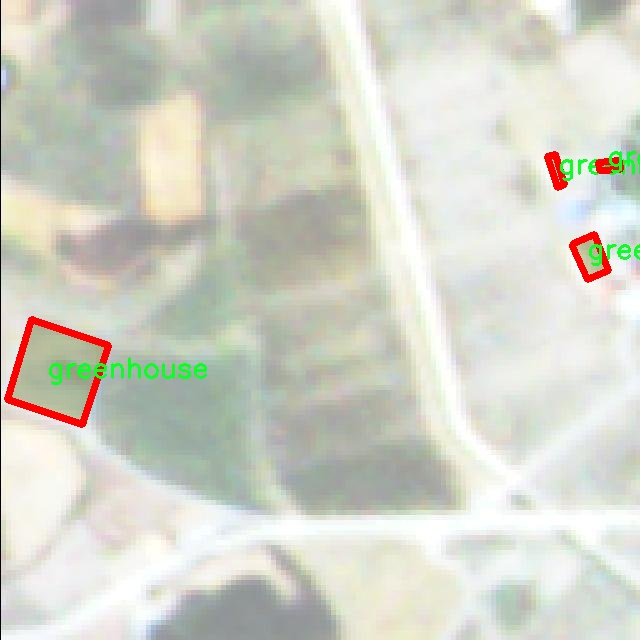

# 遥感温室图像分割系统： yolov8-seg-slimneck

### 1.研究背景与意义

[参考博客](https://gitee.com/YOLOv8_YOLOv11_Segmentation_Studio/projects)

[博客来源](https://kdocs.cn/l/cszuIiCKVNis)

研究背景与意义

随着全球气候变化的加剧，温室农业作为一种高效的农业生产方式，越来越受到重视。温室能够为作物提供一个相对稳定的生长环境，从而提高作物的产量和质量。然而，温室内的环境监测与管理仍然面临诸多挑战，尤其是在作物生长状态的实时监测和病虫害的早期识别方面。传统的人工监测方法不仅效率低下，而且容易受到主观因素的影响，难以满足现代农业的需求。因此，基于遥感技术的智能监测系统应运而生，成为提高温室管理效率的重要手段。

在这一背景下，图像分割技术作为计算机视觉领域的重要研究方向，逐渐被应用于温室农业的各个环节。图像分割能够将图像中的目标物体与背景进行有效区分，为后续的分析和处理提供基础数据。尤其是实例分割技术，能够对同一类别的多个实例进行分离，为温室内不同作物的生长状态监测提供了可能性。YOLO（You Only Look Once）系列模型因其高效的实时检测能力，已成为图像分割领域的重要工具。YOLOv8作为该系列的最新版本，进一步提升了检测精度和速度，适合于复杂环境下的图像处理任务。

本研究旨在基于改进的YOLOv8模型，构建一个高效的遥感温室图像分割系统。我们使用的实例分割数据集“instanceseg128”包含2800幅图像，专注于温室这一特定类别。通过对该数据集的深入分析，我们能够提取出温室内作物的生长特征和环境信息，从而为温室管理提供科学依据。数据集中仅包含一个类别（温室），使得模型的训练和测试更加集中，有助于提高分割的准确性和效率。

本研究的意义在于，通过改进YOLOv8模型，提升温室图像的分割精度，为智能农业的发展提供新的技术支持。首先，精准的图像分割能够为温室内作物的生长监测提供实时数据，帮助农民及时发现生长异常、病虫害等问题，从而采取相应的管理措施。其次，基于遥感技术的监测系统能够减少人工成本，提高工作效率，推动农业的智能化进程。此外，研究成果不仅可以应用于温室农业，还可推广至其他领域，如城市绿化、生态监测等，具有广泛的应用前景。

综上所述，基于改进YOLOv8的遥感温室图像分割系统的研究，不仅具有重要的理论价值，还有助于推动农业生产方式的转型升级，为实现可持续发展目标贡献力量。通过深入探索图像分割技术在温室农业中的应用，我们期待为智能农业的发展提供新的思路和解决方案。

### 2.图片演示







注意：本项目提供完整的训练源码数据集和训练教程,由于此博客编辑较早,暂不提供权重文件（best.pt）,需要按照6.训练教程进行训练后实现上图效果。

### 3.视频演示

[3.1 视频演示](https://www.bilibili.com/video/BV1e1zbYVEeR/)

### 4.数据集信息

##### 4.1 数据集类别数＆类别名

nc: 1
names: ['greenhouse']


##### 4.2 数据集信息简介

数据集信息展示

在本研究中，我们采用了名为“instanceseg128”的数据集，以训练和改进YOLOv8-seg的遥感温室图像分割系统。该数据集专注于遥感图像中的温室分割任务，具有重要的应用价值，尤其是在农业监测和资源管理领域。数据集的设计旨在提供高质量的标注数据，以支持深度学习模型在复杂环境中的表现。

“instanceseg128”数据集的类别数量为1，具体类别为“greenhouse”。这一类别的选择反映了研究的重点，即温室的检测与分割。温室作为现代农业的重要组成部分，其结构特征和生长环境对作物的生长有着直接影响。因此，准确识别和分割温室区域，不仅有助于实现精准农业，还能为后续的农业管理和决策提供数据支持。

数据集中的图像来源于不同的遥感平台，涵盖了多种气候条件和地理环境。这种多样性确保了模型在训练过程中能够学习到温室在不同背景下的特征，从而提高其泛化能力。每幅图像都经过精细的标注，确保温室的边界清晰可辨。这种高质量的标注对于训练深度学习模型至关重要，因为它直接影响到模型的学习效果和最终的分割精度。

在数据集的构建过程中，研究团队特别关注了图像的多样性和复杂性，以模拟实际应用中的各种情况。例如，数据集中包含了不同光照条件下的温室图像，涵盖了白天和夜晚的场景，确保模型能够在各种环境下稳定工作。此外，数据集还包括了不同类型的温室结构，如拱形温室和玻璃温室等，以增强模型的适应性。

为了进一步提高模型的性能，研究团队在数据预处理阶段采用了多种增强技术，如随机裁剪、旋转、翻转等。这些技术不仅增加了数据集的多样性，还有效提升了模型的鲁棒性，使其能够更好地应对现实世界中可能遇到的各种挑战。

在训练过程中，YOLOv8-seg模型将利用“instanceseg128”数据集进行多轮迭代，以优化其参数设置和网络结构。通过对比实验，研究团队将评估模型在不同训练阶段的表现，分析其在温室分割任务中的准确性和效率。最终，期望通过本研究实现对遥感温室图像的高效分割，为农业生产提供更为精准的监测手段。

综上所述，“instanceseg128”数据集不仅为本研究提供了丰富的训练数据，也为遥感图像处理领域的进一步探索奠定了基础。通过对该数据集的深入分析和应用，研究团队希望能够推动温室图像分割技术的发展，进而为现代农业的可持续发展贡献力量。











### 5.项目依赖环境部署教程（零基础手把手教学）

[5.1 环境部署教程链接（零基础手把手教学）](https://www.bilibili.com/video/BV1jG4Ve4E9t/?vd_source=bc9aec86d164b67a7004b996143742dc)


[5.2 安装Python虚拟环境创建和依赖库安装视频教程链接（零基础手把手教学）](https://www.bilibili.com/video/BV1nA4VeYEze/?vd_source=bc9aec86d164b67a7004b996143742dc)

### 6.手把手YOLOV8-seg训练视频教程（零基础手把手教学）

[6.1 手把手YOLOV8-seg训练视频教程（零基础小白有手就能学会）](https://www.bilibili.com/video/BV1cA4VeYETe/?vd_source=bc9aec86d164b67a7004b996143742dc)


按照上面的训练视频教程链接加载项目提供的数据集，运行train.py即可开始训练



     Epoch   gpu_mem       box       obj       cls    labels  img_size
     1/200     0G   0.01576   0.01955  0.007536        22      1280: 100%|██████████| 849/849 [14:42<00:00,  1.04s/it]
               Class     Images     Labels          P          R     mAP@.5 mAP@.5:.95: 100%|██████████| 213/213 [01:14<00:00,  2.87it/s]
                 all       3395      17314      0.994      0.957      0.0957      0.0843

     Epoch   gpu_mem       box       obj       cls    labels  img_size
     2/200     0G   0.01578   0.01923  0.007006        22      1280: 100%|██████████| 849/849 [14:44<00:00,  1.04s/it]
               Class     Images     Labels          P          R     mAP@.5 mAP@.5:.95: 100%|██████████| 213/213 [01:12<00:00,  2.95it/s]
                 all       3395      17314      0.996      0.956      0.0957      0.0845

     Epoch   gpu_mem       box       obj       cls    labels  img_size
     3/200     0G   0.01561    0.0191  0.006895        27      1280: 100%|██████████| 849/849 [10:56<00:00,  1.29it/s]
               Class     Images     Labels          P          R     mAP@.5 mAP@.5:.95: 100%|███████   | 187/213 [00:52<00:00,  4.04it/s]
                 all       3395      17314      0.996      0.957      0.0957      0.0845


### 7.50+种全套YOLOV8-seg创新点加载调参实验视频教程（一键加载写好的改进模型的配置文件）

[7.1 50+种全套YOLOV8-seg创新点加载调参实验视频教程（一键加载写好的改进模型的配置文件）](https://www.bilibili.com/video/BV1Hw4VePEXv/?vd_source=bc9aec86d164b67a7004b996143742dc)

### YOLOV8-seg算法简介

原始YOLOV8-seg算法原理

YOLOv8-seg算法是YOLO系列中的最新一代目标检测与分割算法，旨在通过引入更高效的网络结构和改进的训练策略来提升目标检测和分割的精度与速度。YOLOv8-seg的设计理念基于YOLOv5和YOLOv7的成功经验，同时融入了新的特性和改进，使其在处理复杂场景和多样化目标时表现得更加出色。

YOLOv8-seg的网络结构主要分为三个部分：Backbone、Neck和Head。这种分层结构的设计使得算法能够有效地提取特征、融合多尺度信息并进行最终的目标检测与分割。

在Backbone部分，YOLOv8-seg采用了一系列卷积和反卷积层，以提取输入图像的深层特征。该部分的核心是C2f模块，它是基于YOLOv5的CSPDarknet思想而设计的。C2f模块通过引入ELAN思想，增强了特征提取的能力，具有两个分支结构。第一个分支直接将特征图进行连接，而第二个分支则通过多个Bottleneck网络进行串并联处理，从而有效地提升了梯度流动，缓解了深层网络中的梯度消失问题。这种设计不仅保持了特征图的尺寸一致性，还通过多次shortcut连接增强了浅层特征的重用，确保了模型在深层次特征提取时的稳定性和有效性。

Neck部分采用了PAN-FPN结构，这一结构在YOLOv8-seg中发挥了至关重要的作用。PAN-FPN通过自下而上的特征融合和自上而下的特征传递，能够有效地整合来自不同层次的特征信息。这种多尺度特征融合技术使得YOLOv8-seg能够更好地捕捉到不同尺度目标的特征，增强了目标检测的鲁棒性和准确性。在这一阶段，浅层特征与高层特征的结合使得模型在处理细节信息和语义信息时更加灵活，能够在复杂场景中更准确地识别和分割目标。

Head部分是YOLOv8-seg的关键，它负责将Neck输出的特征图转换为最终的检测和分割结果。YOLOv8-seg采用了Anchor-Free的检测方式，摒弃了传统的Anchor-Base方法，简化了目标检测的过程。Head部分设计了多个解耦头，每个头负责不同尺度的目标检测与分类任务。通过这种解耦结构，YOLOv8-seg能够在不同的特征图尺度上进行独立的分类和回归，从而提高了检测的精度和效率。

在损失函数的设计上，YOLOv8-seg引入了VFLLoss和DFLLoss+CIoULoss的组合，这种新颖的损失函数设计能够有效地解决目标检测中的样本不平衡问题，提升模型的学习效果。此外，YOLOv8-seg还采用了Task-Aligned的样本匹配策略，使得训练过程中的样本匹配更加高效和精准。

数据预处理方面，YOLOv8-seg借鉴了YOLOv5的策略，采用了包括马赛克增强、混合增强、空间扰动和颜色扰动等多种数据增强手段。这些增强技术能够有效地扩展训练数据集，提高模型的泛化能力，使得YOLOv8-seg在面对不同类型的图像时，仍然能够保持较高的检测和分割精度。

总的来说，YOLOv8-seg算法通过引入先进的网络结构和改进的训练策略，显著提升了目标检测与分割的性能。其Backbone、Neck和Head的分层设计使得特征提取、融合和输出的过程更加高效，能够在复杂场景中准确识别和分割目标。YOLOv8-seg不仅在速度上有显著提升，同时在精度上也表现出色，成为了当前目标检测与分割领域的一个重要里程碑。随着YOLOv8-seg的推出，目标检测与分割的研究将进入一个新的阶段，推动相关技术的进一步发展与应用。


### 9.系统功能展示（检测对象为举例，实际内容以本项目数据集为准）

图9.1.系统支持检测结果表格显示

  图9.2.系统支持置信度和IOU阈值手动调节

  图9.3.系统支持自定义加载权重文件best.pt(需要你通过步骤5中训练获得)

  图9.4.系统支持摄像头实时识别

  图9.5.系统支持图片识别

  图9.6.系统支持视频识别

  图9.7.系统支持识别结果文件自动保存

  图9.8.系统支持Excel导出检测结果数据


### 10.50+种全套YOLOV8-seg创新点原理讲解（非科班也可以轻松写刊发刊，V11版本正在科研待更新）

#### 10.1 由于篇幅限制，每个创新点的具体原理讲解就不一一展开，具体见下列网址中的创新点对应子项目的技术原理博客网址【Blog】：


[10.1 50+种全套YOLOV8-seg创新点原理讲解链接](https://gitee.com/qunmasj/good)

#### 10.2 部分改进模块原理讲解(完整的改进原理见上图和技术博客链接)【如果此小节的图加载失败可以通过CSDN或者Github搜索该博客的标题访问原始博客，原始博客图片显示正常】

### YOLOv8简介


由上图可以看出，C2中每个BottlNeck的输入Tensor的通道数channel都只是上一级的0.5倍，因此计算量明显降低。从另一方面讲，梯度流的增加，t也能够明显提升收敛速度和收敛效果。
C2i模块首先以输入tensor(n.c.h.w)经过Conv1层进行split拆分，分成两部分(n,0.5c,h,w)，一部分直接经过n个Bottlenck，另一部分经过每一操作层后都会以(n.0.5c,h,w)的尺寸进行Shortcut，最后通过Conv2层卷积输出。也就是对应n+2的Shortcut(第一层Conv1的分支tensor和split后的tensor为2+n个bottenlenneck)。
#### Neck
YOLOv8的Neck采用了PANet结构，如下图所示。

Backbone最后SPPF模块(Layer9)之后H、W经过32倍下采样，对应地Layer4经过8倍下采样，Layer6经过16倍下采样。输入图片分辨率为640*640，得到Layer4、Layer6、Layer9的分辨率分别为80*80、40*40和20*20。
Layer4、Layer6、Layer9作为PANet结构的输入，经过上采样，通道融合，最终将PANet的三个输出分支送入到Detect head中进行Loss的计算或结果解算。
与FPN(单向，自上而下)不同的是，PANet是一个双向通路网络，引入了自下向上的路径，使得底层信息更容易传递到顶层。
#### Head
Head部分相比Yolov5改动较大，直接将耦合头改为类似Yolo的解耦头结构(Decoupled-Head)，将回归分支和预测分支分离，并针对回归分支使用了Distribution Focal Loss策略中提出的积分形式表示法。之前的目标检测网络将回归坐标作为一个确定性单值进行预测，DFL将坐标转变成一个分布。


### LSKNet的架构
该博客提出的结构层级依次为：

LSK module（大核卷积序列+空间选择机制） < LSK Block （LK Selection + FFN）<LSKNet（N个LSK Block）


#### LSK 模块

LSK Block
LSKNet 是主干网络中的一个可重复堆叠的块（Block），每个LSK Block包括两个残差子块，即大核选择子块（Large Kernel Selection，LK Selection）和前馈网络子块（Feed-forward Network ，FFN），如图8。LK Selection子块根据需要动态地调整网络的感受野，FFN子块用于通道混合和特征细化，由一个全连接层、一个深度卷积、一个 GELU 激活和第二个全连接层组成。

LSK module（LSK 模块，图4）由一个大核卷积序列（large kernel convolutions）和一个空间核选择机制（spatial kernel selection mechanism）组成，被嵌入到了LSK Block 的 LK Selection子块中。

#### Large Kernel Convolutions
因为不同类型的目标对背景信息的需求不同，这就需要模型能够自适应选择不同大小的背景范围。因此，作者通过解耦出一系列具有大卷积核、且不断扩张的Depth-wise 卷积，构建了一个更大感受野的网络。

具体地，假设序列中第i个Depth-wise 卷积核的大小为 ，扩张率为 d，感受野为 ，它们满足以下关系：


卷积核大小和扩张率的增加保证了感受野能够快速增大。此外，我们设置了扩张率的上限，以保证扩张卷积不会引入特征图之间的差距。


Table2的卷积核大小可根据公式（1）和（2）计算，详见下图：


这样设计的好处有两点。首先，能够产生具有多种不同大小感受野的特征，便于后续的核选择；第二，序列解耦比简单的使用一个大型卷积核效果更好。如上图表2所示，解耦操作相对于标准的大型卷积核，有效地将低了模型的参数量。

为了从输入数据  的不同区域获取丰富的背景信息特征，可采用一系列解耦的、不用感受野的Depth-wise 卷积核：


其中，是卷积核为 、扩张率为  的Depth-wise 卷积操作。假设有个解耦的卷积核，每个卷积操作后又要经过一个的卷积层进行空间特征向量的通道融合。


之后，针对不同的目标，可基于获取的多尺度特征，通过下文中的选择机制动态选择合适的卷积核大小。

这一段的意思可以简单理解为：

把一个大的卷积核拆成了几个小的卷积核，比如一个大小为5，扩张率为1的卷积核加上一个大小为7，扩张率为3的卷积核，感受野为23，与一个大小为23，扩张率为1的卷积核的感受野是一样的。因此可用两个小的卷积核替代一个大的卷积核，同理一个大小为29的卷积核也可以用三个小的卷积代替（Table 2），这样可以有效的减少参数，且更灵活。

将输入数据依次通过这些小的卷积核（公式3），并在每个小的卷积核后面接上一个1×1的卷积进行通道融合（公式4）。

#### Spatial Kernel Selection
为了使模型更关注目标在空间上的重点背景信息，作者使用空间选择机制从不同尺度的大卷积核中对特征图进行空间选择。

首先，将来自于不同感受野卷积核的特征进行concate拼接，然后，应用通道级的平均池化和最大池化提取空间关系，其中， 和  是平均池化和最大池化后的空间特征描述符。为了实现不同空间描述符的信息交互，作者利用卷积层将空间池化特征进行拼接，将2个通道的池化特征转换为N个空间注意力特征图，之后，将Sigmoid激活函数应用到每一个空间注意力特征图，可获得每个解耦的大卷积核所对应的独立的空间选择掩膜，又然后，将解耦后的大卷积核序列的特征与对应的空间选择掩膜进行加权处理，并通过卷积层进行融合获得注意力特征 ，最后LSK module的输出可通过输入特征  与注意力特征  的逐元素点成获得，公式对应于结构图上的操作如下：


### 11.项目核心源码讲解（再也不用担心看不懂代码逻辑）

#### 11.1 demo_test_video.py

以下是代码中最核心的部分，并附上详细的中文注释：

```python
import cv2
import numpy as np
from PIL import ImageFont, ImageDraw, Image
from hashlib import md5
from model import Web_Detector
from chinese_name_list import Label_list

def generate_color_based_on_name(name):
    # 使用哈希函数生成稳定的颜色
    hash_object = md5(name.encode())  # 对名字进行MD5哈希
    hex_color = hash_object.hexdigest()[:6]  # 取前6位16进制数
    r, g, b = int(hex_color[0:2], 16), int(hex_color[2:4], 16), int(hex_color[4:6], 16)  # 转换为RGB
    return (b, g, r)  # OpenCV 使用BGR格式

def draw_with_chinese(image, text, position, font_size=20, color=(255, 0, 0)):
    # 在图像上绘制中文文本
    image_pil = Image.fromarray(cv2.cvtColor(image, cv2.COLOR_BGR2RGB))  # 转换为PIL格式
    draw = ImageDraw.Draw(image_pil)  # 创建绘图对象
    font = ImageFont.truetype("simsun.ttc", font_size, encoding="unic")  # 加载中文字体
    draw.text(position, text, font=font, fill=color)  # 绘制文本
    return cv2.cvtColor(np.array(image_pil), cv2.COLOR_RGB2BGR)  # 转换回OpenCV格式

def draw_detections(image, info):
    # 在图像上绘制检测结果
    name, bbox = info['class_name'], info['bbox']  # 获取类别名称和边界框
    x1, y1, x2, y2 = bbox  # 解包边界框坐标
    cv2.rectangle(image, (x1, y1), (x2, y2), color=(0, 0, 255), thickness=3)  # 绘制边界框
    image = draw_with_chinese(image, name, (x1, y1 - 10), font_size=20)  # 绘制类别名称
    return image

def process_frame(model, image):
    # 处理每一帧图像
    pre_img = model.preprocess(image)  # 预处理图像
    pred = model.predict(pre_img)  # 进行预测
    det = pred[0]  # 获取检测结果

    if det is not None and len(det):
        det_info = model.postprocess(pred)  # 后处理得到检测信息
        for info in det_info:
            image = draw_detections(image, info)  # 绘制检测结果
    return image

if __name__ == "__main__":
    model = Web_Detector()  # 初始化检测模型
    model.load_model("./weights/yolov8s-seg.pt")  # 加载模型权重

    # 视频处理
    video_path = ''  # 输入视频路径
    cap = cv2.VideoCapture(video_path)  # 打开视频文件
    while cap.isOpened():
        ret, frame = cap.read()  # 逐帧读取视频
        if not ret:
            break
        processed_frame = process_frame(model, frame)  # 处理当前帧
        cv2.imshow('Processed Video', processed_frame)  # 显示处理后的帧
        if cv2.waitKey(1) & 0xFF == ord('q'):  # 按'q'退出
            break
    cap.release()  # 释放视频捕获对象
    cv2.destroyAllWindows()  # 关闭所有OpenCV窗口
```

### 代码核心部分分析
1. **生成颜色**：`generate_color_based_on_name` 函数使用MD5哈希生成稳定的颜色，以便于在绘制时为每个类别分配不同的颜色。
2. **绘制中文文本**：`draw_with_chinese` 函数使用PIL库在图像上绘制中文文本，确保中文字符能够正确显示。
3. **绘制检测结果**：`draw_detections` 函数负责在图像上绘制检测到的对象的边界框和类别名称。
4. **处理视频帧**：`process_frame` 函数对每一帧图像进行预处理、预测和后处理，并将检测结果绘制到图像上。
5. **主程序**：在`__main__`中，初始化模型并加载权重，打开视频文件，逐帧处理并显示结果。

通过以上分析，代码的核心功能是对视频中的对象进行检测，并将检测结果以可视化的方式呈现出来。

这个程序文件 `demo_test_video.py` 是一个用于视频处理的脚本，主要功能是利用深度学习模型进行目标检测和分割，并在视频帧上绘制检测结果。程序中使用了 OpenCV 和 PIL 库来处理图像和绘制文本，使用了一个名为 `Web_Detector` 的模型类来进行目标检测。

首先，程序导入了一些必要的库，包括 `random`、`cv2`、`numpy`、`PIL` 以及 `hashlib`。这些库分别用于随机数生成、计算机视觉处理、数值计算、图像处理和生成哈希值。

接下来，定义了几个辅助函数。`generate_color_based_on_name` 函数通过对目标名称进行哈希处理，生成一个稳定的颜色值，这样同一名称的目标在视频中将始终使用相同的颜色。`calculate_polygon_area` 函数用于计算多边形的面积，使用 OpenCV 的 `contourArea` 方法。`draw_with_chinese` 函数则负责在图像上绘制中文文本，使用了 PIL 库来处理中文字体。

`adjust_parameter` 函数根据图像的大小调整参数，以确保在不同分辨率下绘制的效果一致。`draw_detections` 函数是核心绘制函数，根据检测到的信息（如类别名称、边界框、置信度、类别 ID 和掩膜）在图像上绘制检测结果。如果存在掩膜，则会填充多边形并计算其面积、周长和圆度等特征，并在图像上显示这些信息。

`process_frame` 函数负责处理每一帧图像。它首先对图像进行预处理，然后使用模型进行预测，最后调用 `draw_detections` 函数将检测结果绘制到图像上。

在主程序部分，首先加载类别名称和模型，然后打开视频文件进行处理。通过循环读取视频帧，调用 `process_frame` 函数处理每一帧，并使用 OpenCV 的 `imshow` 显示处理后的结果。如果用户按下 'q' 键，程序将退出。

整体而言，这个程序通过结合深度学习模型和图像处理技术，实现了对视频中目标的检测和可视化，适用于需要实时监控和分析的视频场景。

#### 11.2 ultralytics\models\yolo\__init__.py

以下是代码中最核心的部分，并附上详细的中文注释：

```python
# 导入Ultralytics YOLO模型的分类、检测、姿态估计和分割功能
from ultralytics.models.yolo import classify, detect, pose, segment

# 从当前模块导入YOLO类
from .model import YOLO

# 定义模块的公开接口，包含分类、分割、检测、姿态估计功能和YOLO类
__all__ = 'classify', 'segment', 'detect', 'pose', 'YOLO'
```

### 详细注释：

1. `from ultralytics.models.yolo import classify, detect, pose, segment`：
   - 这一行代码从`ultralytics`库中导入了YOLO模型的四个主要功能：
     - `classify`：用于图像分类的功能。
     - `detect`：用于目标检测的功能。
     - `pose`：用于姿态估计的功能。
     - `segment`：用于图像分割的功能。

2. `from .model import YOLO`：
   - 这一行代码从当前模块（通常是一个包）中导入了`YOLO`类，这个类可能是YOLO模型的实现，包含了模型的初始化和方法。

3. `__all__ = 'classify', 'segment', 'detect', 'pose', 'YOLO'`：
   - 这一行定义了模块的公开接口，表示当使用`from module import *`时，将会导入这些指定的名称。这样做可以控制模块的可见性，确保只暴露必要的功能和类。

这个程序文件是Ultralytics YOLO模型库中的一个初始化文件，文件名为`__init__.py`。它的主要作用是定义该模块的公共接口，并导入相关的功能模块。

首先，文件开头有一行注释，表明这是Ultralytics YOLO项目的一部分，并且该项目遵循AGPL-3.0许可证。这意味着用户在使用或修改该代码时需要遵循相应的开源协议。

接下来，文件从`ultralytics.models.yolo`模块中导入了四个功能：`classify`（分类）、`detect`（检测）、`pose`（姿态估计）和`segment`（分割）。这些功能模块可能包含实现YOLO模型的不同任务的代码，允许用户在使用YOLO模型时进行多种类型的计算机视觉任务。

然后，文件还从当前目录下的`model`模块中导入了`YOLO`类。这个类可能是YOLO模型的核心实现，负责模型的初始化、训练和推理等功能。

最后，`__all__`变量被定义为一个元组，包含了上述导入的所有功能模块和类的名称。这意味着当使用`from ultralytics.models.yolo import *`语句时，只会导入`classify`、`segment`、`detect`、`pose`和`YOLO`这几个名称，从而控制了模块的公共接口，避免了不必要的名称冲突。

总体来说，这个文件是Ultralytics YOLO库的一个重要组成部分，通过组织和导入不同的功能模块，简化了用户的使用体验。

#### 11.3 ultralytics\utils\patches.py

以下是代码中最核心的部分，并附上详细的中文注释：

```python
import cv2
import numpy as np
import torch

def imread(filename: str, flags: int = cv2.IMREAD_COLOR):
    """
    从文件中读取图像。

    参数:
        filename (str): 要读取的文件路径。
        flags (int, optional): 标志，可以取 cv2.IMREAD_* 的值。默认为 cv2.IMREAD_COLOR。

    返回:
        (np.ndarray): 读取的图像。
    """
    # 使用 cv2.imdecode 读取图像，np.fromfile 以支持多语言文件路径
    return cv2.imdecode(np.fromfile(filename, np.uint8), flags)


def imwrite(filename: str, img: np.ndarray, params=None):
    """
    将图像写入文件。

    参数:
        filename (str): 要写入的文件路径。
        img (np.ndarray): 要写入的图像。
        params (list of ints, optional): 额外参数。参见 OpenCV 文档。

    返回:
        (bool): 如果文件写入成功则返回 True，否则返回 False。
    """
    try:
        # 使用 cv2.imencode 将图像编码并写入文件，支持多语言文件路径
        cv2.imencode(Path(filename).suffix, img, params)[1].tofile(filename)
        return True
    except Exception:
        return False


def imshow(winname: str, mat: np.ndarray):
    """
    在指定窗口中显示图像。

    参数:
        winname (str): 窗口名称。
        mat (np.ndarray): 要显示的图像。
    """
    # 使用 cv2.imshow 显示图像，窗口名称进行编码以避免 Unicode 错误
    cv2.imshow(winname.encode('unicode_escape').decode(), mat)


def torch_save(*args, **kwargs):
    """
    使用 dill（如果存在）序列化 lambda 函数，因为 pickle 无法处理这些函数。

    参数:
        *args (tuple): 传递给 torch.save 的位置参数。
        **kwargs (dict): 传递给 torch.save 的关键字参数。
    """
    try:
        import dill as pickle  # 尝试导入 dill 模块
    except ImportError:
        import pickle  # 如果没有，则使用标准的 pickle 模块

    # 如果没有指定 pickle_module，则使用导入的 pickle
    if 'pickle_module' not in kwargs:
        kwargs['pickle_module'] = pickle
    return torch.save(*args, **kwargs)  # 调用原始的 torch.save 函数
```

### 代码核心部分说明：
1. **imread**: 读取图像文件，支持多语言文件路径，返回图像的 NumPy 数组。
2. **imwrite**: 将图像写入文件，支持多语言文件路径，返回写入成功与否的布尔值。
3. **imshow**: 在指定窗口中显示图像，处理窗口名称以避免 Unicode 错误。
4. **torch_save**: 扩展 PyTorch 的保存功能，支持序列化 lambda 函数，确保兼容性。

这个程序文件 `ultralytics/utils/patches.py` 主要用于对现有功能进行更新和扩展，特别是与图像处理和PyTorch相关的功能。文件中包含了一些对OpenCV和PyTorch函数的“猴子补丁”，以增强其功能或修复潜在的问题。

首先，文件导入了必要的库，包括 `Path`（用于处理文件路径）、`cv2`（OpenCV库，用于图像处理）、`numpy`（用于数值计算）和`torch`（用于深度学习）。接下来，定义了一些函数来替代或扩展OpenCV和PyTorch的原始功能。

在OpenCV部分，定义了三个函数：

1. `imread`：用于从文件中读取图像。该函数接受文件名和读取标志作为参数，使用 `cv2.imdecode` 从文件中读取图像数据，并返回一个NumPy数组。此函数的实现确保了在读取图像时不会因为路径问题而导致错误。

2. `imwrite`：用于将图像写入文件。它接受文件名、图像数据和可选的参数列表。该函数使用 `cv2.imencode` 将图像编码为指定格式，并通过 `tofile` 方法将其写入文件。如果写入成功，返回True；否则返回False。

3. `imshow`：用于在指定窗口中显示图像。它接受窗口名称和图像数据作为参数。为了避免递归错误，使用了 `_imshow` 作为原始 `cv2.imshow` 的别名，并在显示窗口名称时进行了编码处理，以确保兼容多语言环境。

在PyTorch部分，定义了一个函数 `torch_save`，用于保存模型或数据。这个函数的目的是使用 `dill` 库（如果可用）来序列化一些 lambda 函数，因为 `pickle` 在处理这些函数时可能会遇到问题。函数首先尝试导入 `dill`，如果导入失败，则使用标准的 `pickle`。在调用原始的 `torch.save` 函数之前，确保将 `pickle_module` 参数设置为适当的模块。

总的来说，这个文件通过提供更灵活和可靠的图像读写功能以及增强的模型保存功能，提升了Ultralytics YOLO项目的实用性和兼容性。

#### 11.4 ultralytics\models\yolo\classify\__init__.py

```python
# 导入Ultralytics YOLO库中的分类模块
# 该模块用于图像分类任务，包括预测、训练和验证功能

# 从ultralytics.models.yolo.classify.predict导入分类预测器
from ultralytics.models.yolo.classify.predict import ClassificationPredictor

# 从ultralytics.models.yolo.classify.train导入分类训练器
from ultralytics.models.yolo.classify.train import ClassificationTrainer

# 从ultralytics.models.yolo.classify.val导入分类验证器
from ultralytics.models.yolo.classify.val import ClassificationValidator

# 定义模块的公开接口，包含分类预测器、训练器和验证器
__all__ = 'ClassificationPredictor', 'ClassificationTrainer', 'ClassificationValidator'
```

### 代码核心部分解释：
1. **导入模块**：
   - 代码导入了三个主要的类：`ClassificationPredictor`、`ClassificationTrainer` 和 `ClassificationValidator`，它们分别用于图像分类的预测、训练和验证。

2. **`__all__` 声明**：
   - `__all__` 是一个特殊变量，用于定义模块的公共接口。当使用 `from module import *` 时，只有在 `__all__` 中列出的名称会被导入。这有助于控制模块的可见性，避免不必要的名称冲突。

### 总结：
这段代码是Ultralytics YOLO库中与图像分类相关的核心功能的引入部分，主要用于分类任务的预测、训练和验证。

这个程序文件是Ultralytics YOLO模型的一部分，主要用于分类任务。文件的开头包含了版权信息，表明该代码遵循AGPL-3.0许可证。

接下来，文件通过`from`语句导入了三个重要的类：`ClassificationPredictor`、`ClassificationTrainer`和`ClassificationValidator`。这些类分别负责分类任务中的预测、训练和验证功能。具体来说，`ClassificationPredictor`用于进行分类预测，`ClassificationTrainer`用于训练分类模型，而`ClassificationValidator`则用于验证模型的性能。

最后，`__all__`变量定义了当使用`from module import *`语句时，哪些类会被导入。在这里，它包含了之前导入的三个类的名称，确保这些类可以被外部模块访问。

总的来说，这个文件的主要功能是组织和暴露YOLO模型中与分类相关的功能模块，使得其他部分的代码能够方便地使用这些功能。

#### 11.5 ultralytics\models\utils\loss.py

以下是经过简化并添加详细中文注释的核心代码部分：

```python
import torch
import torch.nn as nn
import torch.nn.functional as F
from ultralytics.utils.loss import FocalLoss, VarifocalLoss
from ultralytics.utils.metrics import bbox_iou
from .ops import HungarianMatcher

class DETRLoss(nn.Module):
    """
    DETR (DEtection TRansformer) 损失类。该类计算并返回DETR目标检测模型的不同损失组件。
    包括分类损失、边界框损失、GIoU损失，以及可选的辅助损失。
    """

    def __init__(self, nc=80, loss_gain=None, aux_loss=True, use_fl=True, use_vfl=False):
        """
        初始化DETR损失函数。

        参数:
            nc (int): 类别数量。
            loss_gain (dict): 各种损失组件的系数。
            aux_loss (bool): 是否计算辅助损失。
            use_fl (bool): 是否使用FocalLoss。
            use_vfl (bool): 是否使用VarifocalLoss。
        """
        super().__init__()
        if loss_gain is None:
            loss_gain = {'class': 1, 'bbox': 5, 'giou': 2}
        self.nc = nc  # 类别数量
        self.loss_gain = loss_gain  # 损失系数
        self.aux_loss = aux_loss  # 是否使用辅助损失
        self.fl = FocalLoss() if use_fl else None  # Focal Loss对象
        self.vfl = VarifocalLoss() if use_vfl else None  # Varifocal Loss对象
        self.matcher = HungarianMatcher(cost_gain={'class': 2, 'bbox': 5, 'giou': 2})  # 匹配器

    def _get_loss_class(self, pred_scores, targets, gt_scores, num_gts):
        """计算分类损失。"""
        bs, nq = pred_scores.shape[:2]  # 获取批次大小和查询数量
        one_hot = torch.zeros((bs, nq, self.nc + 1), dtype=torch.int64, device=targets.device)
        one_hot.scatter_(2, targets.unsqueeze(-1), 1)  # 创建one-hot编码
        one_hot = one_hot[..., :-1]  # 去掉最后一类（背景类）
        gt_scores = gt_scores.view(bs, nq, 1) * one_hot  # 计算目标分数

        # 使用Focal Loss或Varifocal Loss计算损失
        if self.fl:
            if num_gts and self.vfl:
                loss_cls = self.vfl(pred_scores, gt_scores, one_hot)
            else:
                loss_cls = self.fl(pred_scores, one_hot.float())
            loss_cls /= max(num_gts, 1) / nq  # 标准化损失
        else:
            loss_cls = nn.BCEWithLogitsLoss(reduction='none')(pred_scores, gt_scores).mean(1).sum()  # 计算BCE损失

        return {'loss_class': loss_cls.squeeze() * self.loss_gain['class']}  # 返回分类损失

    def _get_loss_bbox(self, pred_bboxes, gt_bboxes):
        """计算边界框损失和GIoU损失。"""
        loss = {}
        if len(gt_bboxes) == 0:  # 如果没有真实边界框
            loss['loss_bbox'] = torch.tensor(0., device=self.device)
            loss['loss_giou'] = torch.tensor(0., device=self.device)
            return loss

        # 计算L1损失
        loss['loss_bbox'] = self.loss_gain['bbox'] * F.l1_loss(pred_bboxes, gt_bboxes, reduction='sum') / len(gt_bboxes)
        # 计算GIoU损失
        loss['loss_giou'] = 1.0 - bbox_iou(pred_bboxes, gt_bboxes, xywh=True, GIoU=True)
        loss['loss_giou'] = loss['loss_giou'].sum() / len(gt_bboxes)
        loss['loss_giou'] *= self.loss_gain['giou']
        return loss  # 返回边界框损失和GIoU损失

    def _get_loss(self, pred_bboxes, pred_scores, gt_bboxes, gt_cls):
        """获取总损失。"""
        match_indices = self.matcher(pred_bboxes, pred_scores, gt_bboxes, gt_cls)  # 计算匹配索引
        idx, gt_idx = self._get_index(match_indices)  # 获取索引
        pred_bboxes, gt_bboxes = pred_bboxes[idx], gt_bboxes[gt_idx]  # 根据索引获取预测和真实边界框

        # 创建目标张量
        bs, nq = pred_scores.shape[:2]
        targets = torch.full((bs, nq), self.nc, device=pred_scores.device, dtype=gt_cls.dtype)
        targets[idx] = gt_cls[gt_idx]  # 更新目标张量

        gt_scores = torch.zeros([bs, nq], device=pred_scores.device)
        if len(gt_bboxes):
            gt_scores[idx] = bbox_iou(pred_bboxes.detach(), gt_bboxes, xywh=True).squeeze(-1)  # 计算真实分数

        # 计算分类损失和边界框损失
        loss = {}
        loss.update(self._get_loss_class(pred_scores, targets, gt_scores, len(gt_bboxes)))
        loss.update(self._get_loss_bbox(pred_bboxes, gt_bboxes))
        return loss  # 返回总损失

    def forward(self, pred_bboxes, pred_scores, batch):
        """
        前向传播，计算损失。

        参数:
            pred_bboxes (torch.Tensor): 预测的边界框。
            pred_scores (torch.Tensor): 预测的分数。
            batch (dict): 包含真实信息的字典。

        返回:
            (dict): 包含总损失的字典。
        """
        gt_cls, gt_bboxes = batch['cls'], batch['bboxes']  # 获取真实类别和边界框
        total_loss = self._get_loss(pred_bboxes[-1], pred_scores[-1], gt_bboxes, gt_cls)  # 计算总损失
        return total_loss  # 返回总损失
```

### 代码说明：
1. **类定义**：`DETRLoss`类用于计算DETR模型的损失，包括分类损失和边界框损失。
2. **初始化方法**：初始化类的属性，包括类别数量、损失系数、是否使用辅助损失等。
3. **损失计算方法**：
   - `_get_loss_class`：计算分类损失，使用Focal Loss或BCE损失。
   - `_get_loss_bbox`：计算边界框损失和GIoU损失。
   - `_get_loss`：综合计算分类损失和边界框损失。
4. **前向传播方法**：接收预测的边界框和分数，计算并返回总损失。

这个程序文件定义了一个用于目标检测模型的损失计算类，主要是针对DETR（DEtection TRansformer）模型的损失函数。文件中包含了两个主要的类：`DETRLoss`和`RTDETRDetectionLoss`。`DETRLoss`类负责计算DETR模型的不同损失组件，包括分类损失、边界框损失和GIoU损失，而`RTDETRDetectionLoss`类则扩展了`DETRLoss`，增加了对去噪训练损失的支持。

在`DETRLoss`类的构造函数中，定义了一些属性，包括类别数量、损失增益系数、是否计算辅助损失、是否使用Focal Loss和Varifocal Loss等。通过这些参数，用户可以灵活地配置损失计算的方式。

`_get_loss_class`方法计算分类损失。它通过将目标值转换为one-hot编码形式，并根据预测分数和真实分数计算损失。如果启用了Focal Loss或Varifocal Loss，则使用相应的损失函数进行计算。

`_get_loss_bbox`方法计算边界框损失和GIoU损失。它首先检查是否有真实边界框，如果没有，则返回零损失。然后计算L1损失和GIoU损失，并根据预定义的损失增益系数进行缩放。

`_get_loss_aux`方法用于计算辅助损失，它在每个解码器层上计算损失，并将其汇总。这个方法在计算过程中会考虑到使用的匹配索引。

`_get_loss`方法是核心损失计算函数，它整合了分类损失和边界框损失的计算。它首先通过匈牙利匹配算法获得匹配索引，然后根据这些索引提取预测的边界框和真实的边界框，并计算损失。

`forward`方法是类的入口，接收预测的边界框、分数和真实标签，调用`_get_loss`和`_get_loss_aux`方法计算总损失。

`RTDETRDetectionLoss`类继承自`DETRLoss`，在其`forward`方法中，除了计算标准的检测损失外，还检查是否提供了去噪的元数据，如果有，则计算去噪损失并将其添加到总损失中。

总的来说，这个文件实现了一个灵活且功能强大的损失计算模块，能够适应不同的目标检测任务需求，并支持去噪训练的扩展。

### 12.系统整体结构（节选）

### 程序整体功能和构架概括

该程序是一个基于Ultralytics YOLO模型的计算机视觉项目，主要用于目标检测和分类任务。程序通过多个模块和文件组织了不同的功能，包括视频处理、模型训练、损失计算和图像处理等。整体架构设计合理，各个模块之间通过导入和函数调用进行协作，使得用户能够方便地进行模型的训练、推理和评估。

- **视频处理**：`demo_test_video.py` 文件负责读取视频流，利用YOLO模型进行目标检测，并在视频帧上绘制检测结果。
- **模型接口**：`ultralytics/models/yolo/__init__.py` 文件定义了YOLO模型的公共接口，导入了分类、检测、姿态估计和分割等功能模块。
- **图像处理工具**：`ultralytics/utils/patches.py` 文件提供了对OpenCV和PyTorch的一些增强功能，确保图像读写和模型保存的兼容性。
- **分类功能**：`ultralytics/models/yolo/classify/__init__.py` 文件组织了与分类相关的功能，包括预测、训练和验证。
- **损失计算**：`ultralytics/models/utils/loss.py` 文件实现了目标检测模型的损失计算，支持DETR模型的多种损失组件。

### 文件功能整理表

| 文件路径                                      | 功能描述                                               |
|-------------------------------------------|-----------------------------------------------------|
| `demo_test_video.py`                     | 处理视频流，利用YOLO模型进行目标检测并绘制结果。               |
| `ultralytics/models/yolo/__init__.py`    | 定义YOLO模型的公共接口，导入分类、检测、姿态估计和分割功能模块。 |
| `ultralytics/utils/patches.py`           | 提供对OpenCV和PyTorch的增强功能，确保图像读写和模型保存的兼容性。 |
| `ultralytics/models/yolo/classify/__init__.py` | 组织与分类相关的功能，包括分类预测、训练和验证。              |
| `ultralytics/models/utils/loss.py`       | 实现目标检测模型的损失计算，支持DETR模型的多种损失组件。       |

通过这种模块化的设计，程序能够高效地处理不同的计算机视觉任务，便于扩展和维护。

### 13.图片、视频、摄像头图像分割Demo(去除WebUI)代码

在这个博客小节中，我们将讨论如何在不使用WebUI的情况下，实现图像分割模型的使用。本项目代码已经优化整合，方便用户将分割功能嵌入自己的项目中。
核心功能包括图片、视频、摄像头图像的分割，ROI区域的轮廓提取、类别分类、周长计算、面积计算、圆度计算以及颜色提取等。
这些功能提供了良好的二次开发基础。

### 核心代码解读

以下是主要代码片段，我们会为每一块代码进行详细的批注解释：

```python
import random
import cv2
import numpy as np
from PIL import ImageFont, ImageDraw, Image
from hashlib import md5
from model import Web_Detector
from chinese_name_list import Label_list

# 根据名称生成颜色
def generate_color_based_on_name(name):
    ......

# 计算多边形面积
def calculate_polygon_area(points):
    return cv2.contourArea(points.astype(np.float32))

...
# 绘制中文标签
def draw_with_chinese(image, text, position, font_size=20, color=(255, 0, 0)):
    image_pil = Image.fromarray(cv2.cvtColor(image, cv2.COLOR_BGR2RGB))
    draw = ImageDraw.Draw(image_pil)
    font = ImageFont.truetype("simsun.ttc", font_size, encoding="unic")
    draw.text(position, text, font=font, fill=color)
    return cv2.cvtColor(np.array(image_pil), cv2.COLOR_RGB2BGR)

# 动态调整参数
def adjust_parameter(image_size, base_size=1000):
    max_size = max(image_size)
    return max_size / base_size

# 绘制检测结果
def draw_detections(image, info, alpha=0.2):
    name, bbox, conf, cls_id, mask = info['class_name'], info['bbox'], info['score'], info['class_id'], info['mask']
    adjust_param = adjust_parameter(image.shape[:2])
    spacing = int(20 * adjust_param)

    if mask is None:
        x1, y1, x2, y2 = bbox
        aim_frame_area = (x2 - x1) * (y2 - y1)
        cv2.rectangle(image, (x1, y1), (x2, y2), color=(0, 0, 255), thickness=int(3 * adjust_param))
        image = draw_with_chinese(image, name, (x1, y1 - int(30 * adjust_param)), font_size=int(35 * adjust_param))
        y_offset = int(50 * adjust_param)  # 类别名称上方绘制，其下方留出空间
    else:
        mask_points = np.concatenate(mask)
        aim_frame_area = calculate_polygon_area(mask_points)
        mask_color = generate_color_based_on_name(name)
        try:
            overlay = image.copy()
            cv2.fillPoly(overlay, [mask_points.astype(np.int32)], mask_color)
            image = cv2.addWeighted(overlay, 0.3, image, 0.7, 0)
            cv2.drawContours(image, [mask_points.astype(np.int32)], -1, (0, 0, 255), thickness=int(8 * adjust_param))

            # 计算面积、周长、圆度
            area = cv2.contourArea(mask_points.astype(np.int32))
            perimeter = cv2.arcLength(mask_points.astype(np.int32), True)
            ......

            # 计算色彩
            mask = np.zeros(image.shape[:2], dtype=np.uint8)
            cv2.drawContours(mask, [mask_points.astype(np.int32)], -1, 255, -1)
            color_points = cv2.findNonZero(mask)
            ......

            # 绘制类别名称
            x, y = np.min(mask_points, axis=0).astype(int)
            image = draw_with_chinese(image, name, (x, y - int(30 * adjust_param)), font_size=int(35 * adjust_param))
            y_offset = int(50 * adjust_param)

            # 绘制面积、周长、圆度和色彩值
            metrics = [("Area", area), ("Perimeter", perimeter), ("Circularity", circularity), ("Color", color_str)]
            for idx, (metric_name, metric_value) in enumerate(metrics):
                ......

    return image, aim_frame_area

# 处理每帧图像
def process_frame(model, image):
    pre_img = model.preprocess(image)
    pred = model.predict(pre_img)
    det = pred[0] if det is not None and len(det)
    if det:
        det_info = model.postprocess(pred)
        for info in det_info:
            image, _ = draw_detections(image, info)
    return image

if __name__ == "__main__":
    cls_name = Label_list
    model = Web_Detector()
    model.load_model("./weights/yolov8s-seg.pt")

    # 摄像头实时处理
    cap = cv2.VideoCapture(0)
    while cap.isOpened():
        ret, frame = cap.read()
        if not ret:
            break
        ......

    # 图片处理
    image_path = './icon/OIP.jpg'
    image = cv2.imread(image_path)
    if image is not None:
        processed_image = process_frame(model, image)
        ......

    # 视频处理
    video_path = ''  # 输入视频的路径
    cap = cv2.VideoCapture(video_path)
    while cap.isOpened():
        ret, frame = cap.read()
        ......
```


### 14.完整训练+Web前端界面+50+种创新点源码、数据集获取


# [下载链接：https://mbd.pub/o/bread/Z5uTlphs](https://mbd.pub/o/bread/Z5uTlphs)